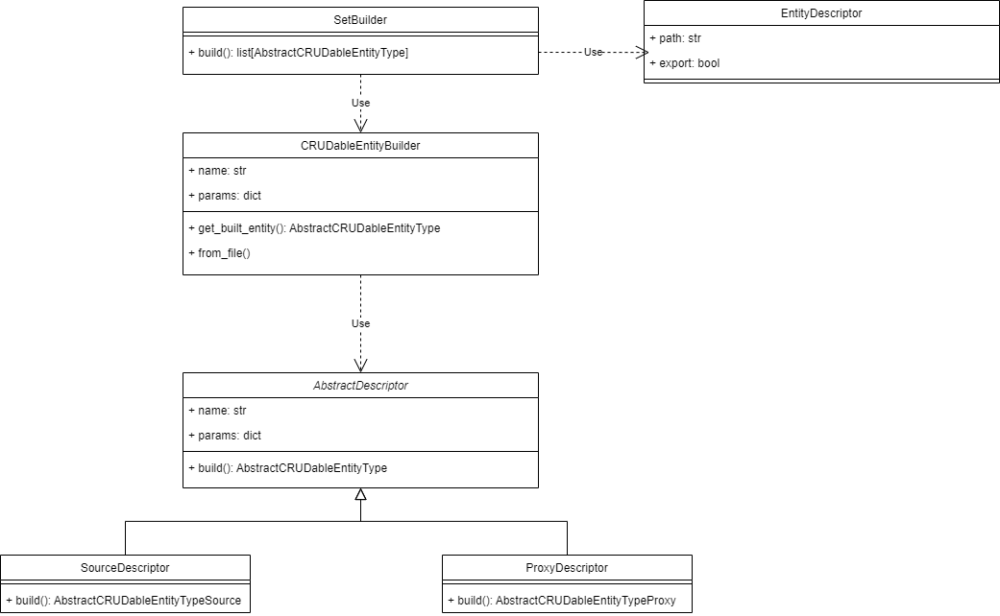

Builders
================

.. contents:: Contents
    :depth: 2
    :local:
    

|
|

Building from .json files
-------------------------------------------

CRUDableEntityBuilder
^^^^^^^^^^^^^^^^^^^^^^^^^^^^

.. module:: crudcreator.builder.CRUDableEntityBuilder
    :noindex:

.. autoclass:: CRUDableEntityBuilder
    :members:

SetBuilder
^^^^^^^^^^^^^^^^^^^^^^^^^^^^

.. module:: crudcreator.builder.SetBuilder
    :noindex:

.. autoclass:: SetBuilder
    :members:

|
|

.. autopydantic_model:: EntityDescriptor
    :members:
    :model-show-json: false
    :model-show-field-summary: false

Descriptors
^^^^^^^^^^^^^^^^^^^^^^^^^^^^

.. module:: crudcreator.AbstractDescriptor
    :noindex:

.. autopydantic_model:: AbstractDescriptor
    :members:
    :model-show-json: false
    :model-show-field-summary: false

|
|

.. module:: crudcreator.source.SourceDescriptor
    :noindex:

.. autopydantic_model:: SourceDescriptor
    :members:
    :model-show-json: false
    :model-show-field-summary: false

|
|

.. module:: crudcreator.proxy.ProxyDescriptor
    :noindex:

.. autopydantic_model:: ProxyDescriptor
    :members:
    :model-show-json: false
    :model-show-field-summary: false