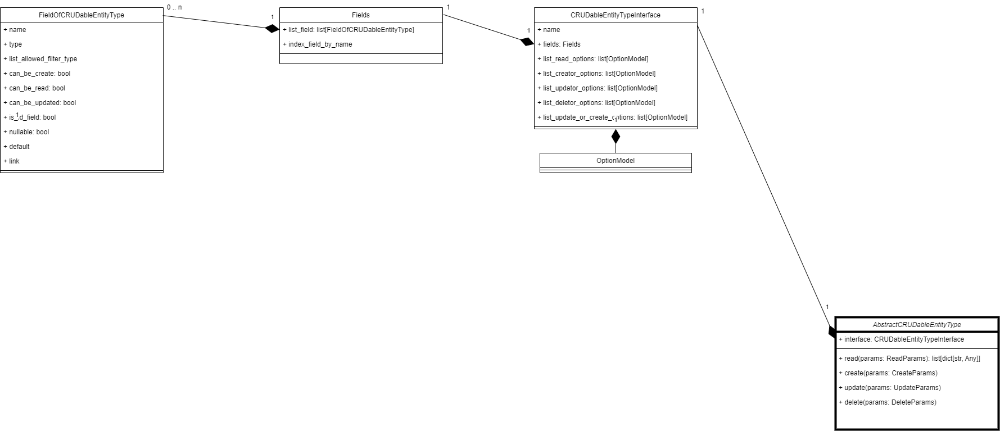

Entity type
=======================

.. contents:: Contents
    :depth: 2
    :local:

AbstractCRUDableEntityType
---------------------------

.. module:: crudcreator.AbstractCRUDableEntityType
    :noindex:

.. autopydantic_model:: AbstractCRUDableEntityType
    :members:
    :model-show-json: false
    :model-show-field-summary: false

CRUDableEntityTypeInterface
---------------------------

.. module:: crudcreator.interface.CRUDableEntityTypeInterface
    :noindex:

.. autopydantic_model:: CRUDableEntityTypeInterface
    :members:
    :model-show-json: false
    :model-show-field-summary: false

Fields
---------------------------

.. module:: crudcreator.Fields
    :noindex:

.. autopydantic_model:: Fields
    :members:
    :model-show-json: false
    :model-show-field-summary: false

FieldOfCRUDableEntityType
---------------------------

.. module:: crudcreator.FieldOfCRUDableEntityType
    :noindex:

.. autopydantic_model:: FieldOfCRUDableEntityType
    :members:
    :model-show-json: false
    :model-show-field-summary: false

OptionModel
---------------------------

.. module:: crudcreator.OptionModel
    :noindex:

.. autopydantic_model:: OptionModel
    :members:
    :model-show-json: false
    :model-show-field-summary: false
