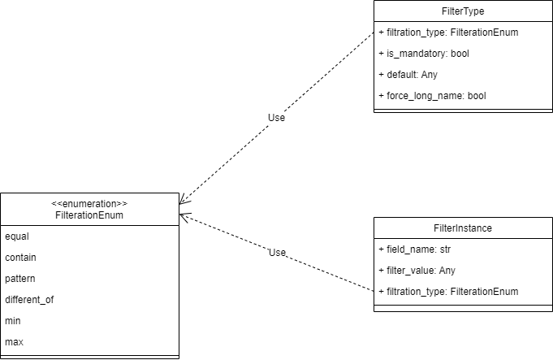

Filters
==============

Filters are used for reading.

.. contents:: Contents
    :depth: 2
    :local:

.. module:: crudcreator.Filter
    :noindex:

FilterInstance
---------------------------

.. autopydantic_model:: FilterInstance
    :members:
    :model-show-json: false
    :model-show-field-summary: false

FilterType
---------------------------

.. autopydantic_model:: FilterType
    :members:
    :model-show-json: false
    :model-show-field-summary: false

FilterationEnum
---------------------------

.. autoclass:: FilterationEnum()
    :members: