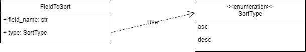

Sorts
==============

"Sorts" are used for reading.

.. contents:: Contents
    :depth: 2
    :local:

.. module:: crudcreator.Sort
    :noindex:

FieldToSort
---------------------------

.. autopydantic_model:: FieldToSort
    :members:
    :model-show-json: false
    :model-show-field-summary: false

SortType
---------------------------

.. autoclass:: SortType()
    :members:
