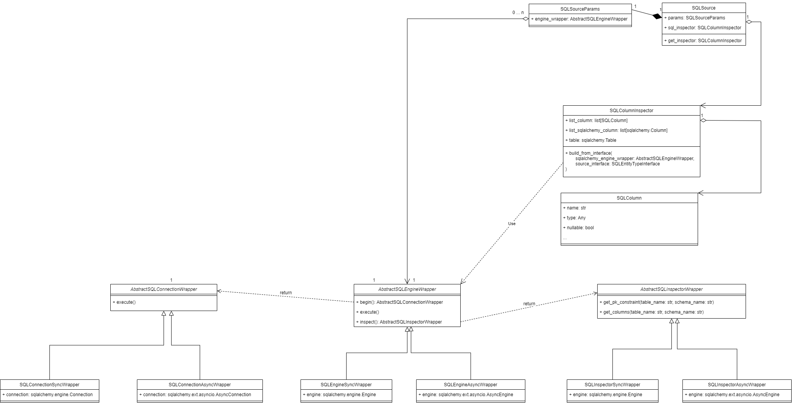

SQL source
==============

.. contents:: Contents
    :depth: 2
    :local:
    

|
|

.. module:: crudcreator.source.source.SQLSource
    :noindex:

.. autopydantic_model:: SQLSource
    :members:
    :model-show-json: false
    :model-show-field-summary: false

|
|

.. autopydantic_model:: SQLSourceParams
    :members:
    :model-show-json: false
    :model-show-field-summary: false

Engine wrapper
-----------------------

.. module:: crudcreator.adaptator.sql.engine_wrapper.SQLEngineWrapper
    :noindex:

.. autopydantic_model:: AbstractSQLEngineWrapper
    :members:
    :model-show-json: false
    :model-show-field-summary: false

|
|

.. autopydantic_model:: SQLEngineSyncWrapper
    :members:
    :model-show-json: false
    :model-show-field-summary: false

|
|

.. autopydantic_model:: SQLEngineAsyncWrapper
    :members:
    :model-show-json: false
    :model-show-field-summary: false

Connection wrapper
-----------------------

.. module:: crudcreator.adaptator.sql.engine_wrapper.SQLConnectionWrapper
    :noindex:

.. autopydantic_model:: AbstractSQLConnectionWrapper
    :members:
    :model-show-json: false
    :model-show-field-summary: false

|
|

.. autopydantic_model:: SQLConnectionSyncWrapper
    :members:
    :model-show-json: false
    :model-show-field-summary: false

|
|

.. autopydantic_model:: SQLConnectionAsyncWrapper
    :members:
    :model-show-json: false
    :model-show-field-summary: false

Inspector wrapper
-----------------------

.. module:: crudcreator.adaptator.sql.engine_wrapper.SQLInspectorWrapper
    :noindex:

.. autopydantic_model:: AbstractSQLInspectorWrapper
    :members:
    :model-show-json: false
    :model-show-field-summary: false

|
|

.. autopydantic_model:: SQLInspectorSyncWrapper
    :members:
    :model-show-json: false
    :model-show-field-summary: false
    
|
|

.. autopydantic_model:: SQLInspectorAsyncWrapper
    :members:
    :model-show-json: false
    :model-show-field-summary: false

SQLColumnInspector
-----------------------

.. module:: crudcreator.adaptator.sql.SQLColumnInspector
    :noindex:

.. autopydantic_model:: SQLColumnInspector
    :members:
    :model-show-json: false
    :model-show-field-summary: false

|
|

.. autopydantic_model:: SQLColumn
    :members:
    :model-show-json: false
    :model-show-field-summary: false