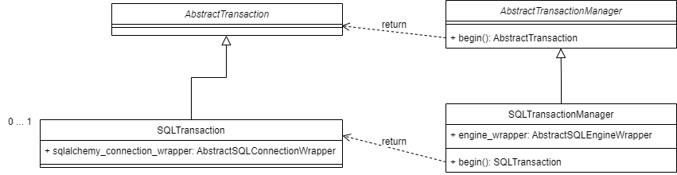

Transaction
================

.. contents:: Contents
    :depth: 2
    :local:
    

Abstract classes
---------------------------

.. module:: crudcreator.transaction.AbstractTransactionManager
    :noindex:

.. autopydantic_model:: AbstractTransactionManager
    :members:
    :model-show-json: false
    :model-show-field-summary: false

|
|

.. module:: crudcreator.transaction.AbstractTransaction
    :noindex:

.. autopydantic_model:: AbstractTransaction
    :members:
    :model-show-json: false
    :model-show-field-summary: false

Concrete classes
---------------------------

.. module:: crudcreator.transaction.sql.SQLTransactionManager
    :noindex:

.. autopydantic_model:: SQLTransactionManager
    :members:
    :model-show-json: false
    :model-show-field-summary: false

|
|

.. module:: crudcreator.transaction.sql.SQLTransaction
    :noindex:

.. autopydantic_model:: SQLTransaction
    :members:
    :model-show-json: false
    :model-show-field-summary: false