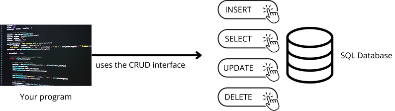
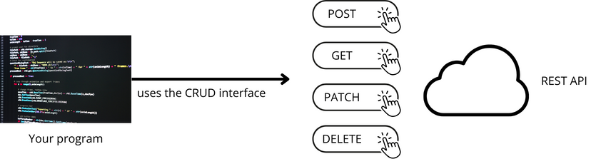
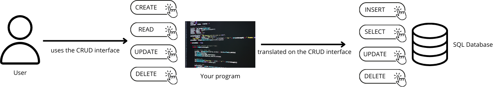
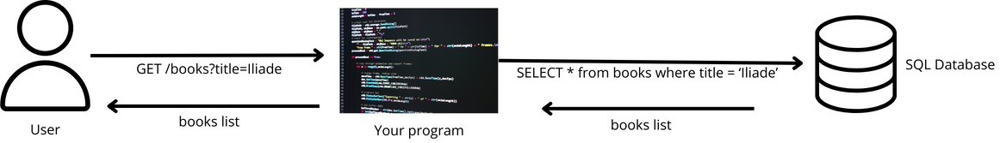
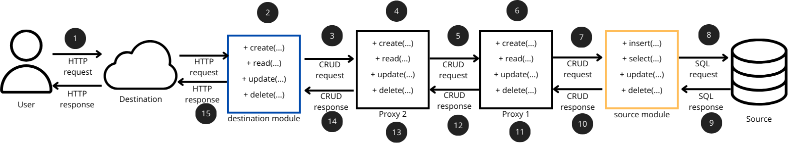
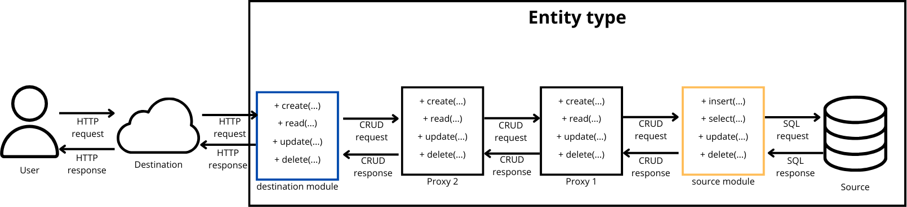

Introduction
==================

What is CRUDCreator?
-------------------------------

Most of your **programs** manipulate data. The data the program uses comes from a **source**. This source can be a user input, a database, an external API, a sensor, etc.

To interact with the data source, the program's actions are usually reduced to reading, creating, updating and deleting data. These 4 actions are grouped together under the acronym "**CRUD**" (Create Read Update Delete).

We'll use the term "**CRUD interface**" to designate an interface, made available by a data source, which enables the user to perform these 4 actions on the source's data. For example:

* a SQL database provides a CRUD interface for manipulating database data:
   * READ with a SELECT ;
   * CREATE with an INSERT ;
   * UPDATE with an UPDATE ;
   * and DELETE with a DELETE.

* A REST interface can also be a CRUD interface. In this case, even if the developer has a choice, the norm is that:
   * READ is done with a GET ;
   * CREATE is done with a POST
   * UPDATE is done with a PATCH ;
   * and DELETE is done with a DELETE.

Sometimes, your program itself provides the user with a CRUD interface to interact with a data source.

Obviously, the program's interface is not exactly the same as the interface of its source. Otherwise, what's the point of creating an intermediate program? Giving the user simple access to the source would have been enough.

The Web world contains a large number of such programs: the back end provides the front end with a REST interface that implements a CRUD. The back simply translates the REST request into a SQL query. A "GET /books?title=Iliade" simply becomes "SELECT * from books where title='Iliade'".

Sometimes, the query is translated as is. But at other times, functional logic is added. Sometimes, we'll want our program to reprocess the data read from the database (to change attribute names, for example), or we'll want the user to receive only the data he's authorized to read (the back end will then add a where clause to filter on the username of the user who made the GET).

CRUDCreator lets you transform a CRUD interface (e.g. SQL) into another CRUD interface (e.g. REST), while providing modules for commonly used functional logics. No need to implement dozens and dozens of simple CRUD routes by hand. No need to re-implement the same CRUD logic from one project to the next. CRUDCreator will create your CRUD interface automatically.

.. _how_does_it_work:

How does it work?
-------------------------------

CRUDCreator allows you to transform a CRUD interface (SQL for example) into another CRUD interface (REST for example). All you need to do is give it a **CRUD source** to connect to (in our example, a SQL database), give it a list of **proxies/modules** that will transform the behavior of the source's CRUD interface, and then give it the type of **CRUD destination** to implement (in our example, a REST API).

Let's try to understand the scheme by giving a runtime example:

#. the user calls the GET route of the REST API generated by crudcreator.
#. This request is transformed into a **generic CRUD request** (a *read* in our example) by the **destination module**.
#. This generic request is then passed to the *Proxy 2*,
#. which does with it what it pleases (can modify the query filters, add filters to the query, etc.).
#. *Proxy 2* then passes the CRUD request to *Proxy 1*,
#. who also does what he wants with it (6).
#. *Proxy 1* then passes the request to the **source module**,
#. which transforms the generic CRUD request (read) into an SQL query (SELECT), and sends it to the database.
#. The database returns a result,
#. which is passed to *Proxy 1*,
#. who can process it as he sees fit (change attribute names, for example).
#. *Proxy 1* then passes the reprocessed result to *Proxy 2*,
#. who can also modify it.
#. Then *Proxy 2* returns the result to the destination module,
#. which will transform it into an HTTP response and send it back to the user.

The example has 2 proxies, but it could of course have any number.

Note that the proxies implement an interface that depends on neither source nor destination (a *create* method, a *read* method, an *update* method and a *delete* method). This allows the same proxies to be reused, regardless of the type of source the program connects to, and regardless of the type of destination the program implements. This is why we spoke of a "generic CRUD request" earlier. This is an abstraction. The destination module transforms the **concrete request** (HTTP request, for example) into a generic CRUD request. The source module then transforms the generic CRUD request into a concrete query (SQL query, for example).

Proxies can be implemented by the developer using CRUDCreator, or can be found directly in CRUDCreator, which already implements a number of them (see :ref:`doc_proxy` for a list of proxies implemented in CRUDCreator).

The whole "Source-Proxy-Proxy-...-Proxy" string defines what we'll call a **type of entity (CRUDable)**.

The program can define a **entity type** without plugging in a destination, and use it directly. In this case, it will be up to the program to construct the CRUD queries to be performed.

   
